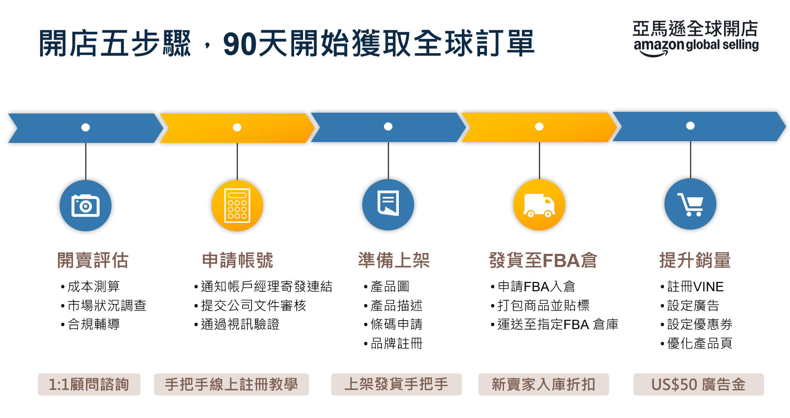

# 亞馬遜日本站-經營指導手冊

<aside>

**編輯者: 亞馬遜全球開店 台灣資深業務拓展經理 黃馨儀**

✉️[hsinyih@amazon.com](mailto:hsinyih@amazon.com) | 📞+886-2-6631-9471 |📱**LINE ID:** @503udqst

</aside>

<aside>

# [亞馬遜日本站30天開賣計畫](https://m.media-amazon.com/images/G/28/TWGS/OBSS/Seller_ramp-up_JP.pdf) (必看)

</aside>

---

<aside>

# 【01】入駐日本站相關優惠🎁

</aside>

## 新賣家入門大禮包

[新賣家入門大禮包](https://sellercentral.amazon.co.jp/help/hub/reference/external/GXMJ38VA95GUN5XU?locale=zh-TW): 完成指定任務獲得最高達5萬美元福利。幫助賣家透過品牌註冊、亞馬遜物流、亞馬遜廣告、亞馬遜優惠券等在初期快速成長。

1. 品牌回饋加碼5%~10%
2. VINE 200美金抵用金
3. 商品推廣廣告折扣卷50美元! 優惠卷費用50美元!
4. 自動加入亞馬遜新品入倉優惠計畫, 免倉儲費用, 免移除和免費退貨處理!
5. 超過600美金庫存及配送費用優惠, 倉儲利用附加費, 低量庫存費! 前100件亞馬遜多管道配送商品享九折配送費! 400美元的入庫配置無誤費抵免額!
6. FBA入庫運輸優惠200美金

<aside>

- 💡其他資訊:
    
    [新賣家入門大禮包詳細條款](https://sellercentral.amazon.co.jp/help/hub/reference/external/GXMJ38VA95GUN5XU?locale=zh-TW)
    
    [商品推廣廣告](https://advertising.amazon.com/ja-jp?ref_=a20m_us_hnav_p_sp)
    
    [優惠券](https://sellercentral.amazon.co.jp/help/hub/reference/external/G3QLEV6W2QK84C57?locale=zh-TW)
    
    什麼是[VINE?](https://sellercentral.amazon.co.jp/help/hub/reference/external/G92T8UV339NZ98TN?locale=zh-TW)
        [Amazon Vine 計畫4大政策更新與優惠一次看！](https://gs.amazon.com.tw/news/vine-program-update-250502)
    
        [亞馬遜Vine計畫規則更新，嚴禁合併違規變體](https://gs.amazon.com.tw/news/vine-program-updates-parent-asin-250502?ld=SOTWSOAMKTFB0505) 
    
        ▶️[亞馬遜VINE計畫介紹＆實操教學短影音](https://www.youtube.com/watch?v=QWS43qeMB5M&list=PL_T89DpPP7kIrAZrkzsLim5TwvhLPRHzp&index=20)
    
</aside>

---

<aside>

# 【02】亞馬遜日本站開通帳號流程📖

</aside>

## 全新賣家(第一次在亞馬遜上銷售)

<aside>

亞馬遜帳號註冊, 請提供以下資訊給[亞馬遜官方經理](https://www.notion.so/1eb57bc15af780f98004c79e74f309d4?pvs=21)在內部系統建檔, 在取得資訊後**經理會提供註冊連結**, 賣家須從**經理發出的註冊連結**完成帳號註冊才能有完整的輔導權限跟優惠。

(如果聯繫經理前已註冊好亞馬遜帳號, 也還是可以先找經理, 幫您確認輔導資格。)

</aside>

### 提供以下資訊給[亞馬遜官方經理](https://www.notion.so/1eb57bc15af780f98004c79e74f309d4?pvs=21)發註冊連結:

1. 公司名稱:
2. 聯絡人姓名:
3. 聯絡人電話:
4. 聯絡人email:
5. 負責人姓名:
6. 負責人email:
7. 註冊帳號用的email (建議用公用信箱避免人員異動造成帳號登入問題):

### 台灣公司註冊

- 使用台灣公司註冊亞馬遜日本站[需要準備的資料](https://m.media-amazon.com/images/G/28/TWGS/SU/TW_GS_Registration_Guidebook_DSR_Grex.pdf#page=6):
    1. 公司文件彩色掃描件
    2. 法定代表人護照or身分證彩色掃描件
    3. 付款信用卡
    4. 聯繫方式

### 日本公司註冊

- 使用日本公司註冊亞馬遜日本站需要準備的資料:
    1. 負責人身分證明 (日本政府發行的有臉部照片的身分證明)（例：護照或駕照等）
    2. 地址證明 (以下文件擇一，文件地址需要同註冊帳號的公司或同負責人資訊並為過去180天內發行)
    -**來自企業編號發布網站的螢幕截圖 (首推使用此文件, 到[https://www.houjin-bangou.nta.go.jp/](https://www.houjin-bangou.nta.go.jp/) 查詢公司資料下載)**
    -**履歷事項全部證明書 (首推使用此文件)**
    -水費帳單
    -網路費帳單
    -電費帳單
    -租金收據
    -瓦斯費帳單
    -電話費帳單
    -銀行帳戶/信用卡對帳單
    3. 付款信用卡
    4. 聯繫方式
    5. 履歷事項全部證明書

<aside>

- 💡註冊過程的相關資源:
    1. [亞馬遜賣家帳號註冊手冊](https://m.media-amazon.com/images/G/28/TWGS/SU/TW_GS_Registration_Guidebook_DSR_Grex.pdf) (包含需準備資料的細節跟具體操作步驟)
    2. ▶️[註冊0-1手把手短影音](https://www.youtube.com/watch?v=kz5sBjClUnU)
    3. ▶️[亞馬遜帳號註冊實操教學](https://www.youtube.com/watch?v=UpezGtT3B6Q)
    4. 操作過程遇到問題請找[亞馬遜官方經理](https://www.notion.so/1eb57bc15af780f98004c79e74f309d4?pvs=21)
    
      公司英文名查詢: [經濟部登記系統查詢](https://fbfh.trade.gov.tw/fb/web/queryBasicf.do)
    
      公司與信用卡英文地址查詢: [郵局中文地址英譯](https://www.post.gov.tw/post/internet/Postal/index.jsp?ID=207#result)
    
</aside>

## 既有賣家(已有亞馬遜賣家帳號)

請先找[亞馬遜官方經理](https://www.notion.so/1eb57bc15af780f98004c79e74f309d4?pvs=21)確認欲開設的站點之輔導資格跟相關優惠。

<aside>

- 💡從賣家後台(非日本站)切換到日本站點:
    
    如下圖, 由亞馬遜賣家後台, 點擊視窗上方【店鋪名稱|站點】處 > 點擊【日本】
    
    
    
</aside>

## 帳號開通後

收到團隊審核結果通知帳號開通, 即可登入賣家後台維護以下基本資訊:

亞馬遜日本站登入[連結](https://reurl.cc/86v6xX)

- **維護公司統編**: 賣家後台【設定】(視窗右上角齒輪)處 > 帳戶資訊 > 稅務資訊 > 增值稅資訊→新增 VAT/GST 登記號
- [**設定存款方式**](https://m.media-amazon.com/images/G/28/TWGS/SU/TW_GS_Registration_Guidebook_DSR_Grex.pdf#page=80): 賣家後台【設定】(視窗右上角齒輪)處 > 帳戶資訊 > 付款資訊 > 存款方式→新增存款方式→指派日本站點存款方式
- [**改用Google Authenticator取代手機驗證**](https://gs.amazon.com.tw/blog/google-authenticator-230927): 手機收驗證簡訊透過多個單位跨國傳送, 不穩定的時候會一段時間收不到簡訊
- 其他[**管理帳戶設定](https://sellercentral.amazon.co.jp/help/hub/reference/external/G69035?locale=zh-TW):**更新賣家帳戶資訊、設定和編輯使用者權限、

<aside>

- 💡其他資訊:
    1. [維護公司統編的意義與須知](https://sellercentral.amazon.com/help/hub/reference/external/202161060?ref=efph_202161060_relt_G4BBHW7XBNS2GMWU&locale=zh-TW)
    2. [設定收款帳戶時，無法收到驗證簡訊](https://m.media-amazon.com/images/G/28/TWGS/SU/TW_GS_Registration_Guidebook_DSR_Grex.pdf#page=81)
</aside>

---

<aside>

# 【03】成本預估💰

</aside>

亞馬遜銷售成本:

1. **亞馬遜專業帳戶月費**: 每月日幣4,900 元  , (未申報統編將收5%營業稅= 日幣 5,145元)   
2. **成交手續費**: 即銷售傭金, 依照[商品類別](https://sellercentral.amazon.co.jp/help/hub/reference/external/GT23F3ST7FEZKT9A?locale=zh-TW&initialSessionID=356-3357753-9849531&ld=SOTWSOAIGLOGISTICSNULLMKTJPFeeChange251208)收取成交訂單金額的8~15%
3. **亞馬遜FBA物流+倉儲費**: 日本亞馬遜倉到消費者端的物流費以及月度倉儲費 
使用[FBA計算機](https://sellercentral.amazon.co.jp/hz/fba/profitabilitycalculator/index?lang=zh_TW)估算亞馬遜FBA物流+倉儲費成本 ([FBA計算機使用方式說明](https://www.youtube.com/watch?v=rOqNx-bzMG8))

<aside>

- 💡其他資訊:
    - [什麼是FBA?](https://m.media-amazon.com/images/G/28/TWGS/Onboarding/FBA_STA_Guide_2024.pdf#page=3)
    - [不用FBA, 由賣家直接發貨給賣家(FBM)](https://gs.amazon.com.tw/fbm)
- 💡FBA相關費用計算公式&說明:
    
          [亞馬遜日本站倉儲月費](https://sellercentral.amazon.co.jp/help/hub/reference/external/G200612770?ref=efph_GABBX6GZPA8MSZGW_cont_201411300&locale=zh-TW)
    
          [亞馬遜日本站FBA配送費用](https://sellercentral.amazon.co.jp/help/hub/reference/external/201112670)
    
          [FBA 退貨和報廢處置費用](https://sellercentral.amazon.co.jp/help/hub/reference/external/G200685050?locale=zh-TW)
    
          ▶️[亞馬遜成本介紹計算短影音](https://www.youtube.com/watch?v=rOqNx-bzMG8)
    
</aside>

1. **亞馬遜站內[廣告](https://www.notion.so/1eb57bc15af780f98004c79e74f309d4?pvs=21)費用**: 透過設定預算上限控制總支出。建議新品至少投資10~20%銷售額或商品成本於廣告支出上。
2. **亞馬遜站內[促銷](https://www.notion.so/1eb57bc15af780f98004c79e74f309d4?pvs=21)費用**: 透過設定預算上限控制總支出。

---

<aside>

# 【04】產品合規🔌

</aside>

**合規準備步驟:**

1. 確認產品是否需要合規檢驗
    1. 電器商品請注意PSE、METI, 藍芽或wifi商品請注意Telec檢驗
        1. PSE: [審核規範](https://sellercentral.amazon.co.jp/help/hub/reference/external/GHJPQ6KDLA9N5F4L?locale=zh-TW)，閱讀後備齊文件, 於上架後將文件email至: [jp-electronics-safety@amazon.co.jp](mailto:jp-electronics-safety@amazon.co.jp)   
            
            [Amazon JP_PSE申請範本.docx](Amazon_JP_PSE%E7%94%B3%E8%AB%8B%E7%AF%84%E6%9C%AC.docx)
            
        2. Giteki: [審核規範](https://sellercentral.amazon.co.jp/help/hub/reference/external/GV3N5ES8KNR3W3VG?locale=zh-TW)，閱讀後備齊文件, 於上架後將文件email至: [jp-giteki-safety@amazon.co.jp](mailto:jp-giteki-safety@amazon.co.jp)    
            
            [Amazon JP_Giteki申請範本.docx](Amazon_JP_Giteki%E7%94%B3%E8%AB%8B%E7%AF%84%E6%9C%AC.docx)
            
    2. 嬰幼兒商品請注意須完成日本食品衛生法(JFSL)檢驗
    3. 食品、會接觸食品的容器、美妝品、須完成JFSL檢驗
        1. [有效期的產品進倉規範](https://sellercentral.amazon.co.jp/help/hub/reference/external/201003420?locale=zh-TW): 若要符合 FBA 的資格，食品和飲料產品以及隨食品或飲料配送的產品必須以批號管控，且庫存在物流中心接收時的最低剩餘架儲期必須超過 **60 天**。產品在抵達時，Amazon 會將距離到期日 45 天內的產品標記為報廢處置。
    4. 其他不確定的請諮詢[亞馬遜官方經理](https://www.notion.so/1eb57bc15af780f98004c79e74f309d4?pvs=21)
2. 針對需要合規檢驗的產品準備相關報告與文件
3. 提交文件到亞馬遜後台通過上架審核
4. 提交文件給頭程物流服務商在進口報關審核用

<aside>

- 💡其他資訊:
    
    [亞馬遜官方第三方服務商清單](https://m.media-amazon.com/images/G/28/TWGS/Website/SPN_PDF/TWAGS_SP_JP.pdf?initialSessionID=355-3002025-1543835&ld=NSGoogle#page=36): 協助評估產品所需的檢驗項目, 流程, 費用
    
    [亞馬遜日本站新賣家合規檢查表](https://m.media-amazon.com/images/G/28/TWGS/SU/New_Seller_Compliance_Guidebook_JP.pdf)
    
</aside>

---

<aside>

# 【05】金流

</aside>

<aside>

- **亞馬遜費用結算期**: 每14天結算一次, 收支互抵後有收入的情況會收到款項, 須支付的情況會由[信用卡](https://www.notion.so/1eb57bc15af780f98004c79e74f309d4?pvs=21)扣款。
- 收款方式後續都可以在賣家後台做切換。
</aside>

**亞馬遜接受以下任一方法收取貨款：**

1. **日本地區的有效銀行帳戶**: 用當地貨幣接收亞馬遜銷售款。
2. **第三方金流**: 使用參加“支付服務商計畫”的支付服務商提供給您的銀行帳戶。目前支援台灣賣家的支付服務商含 Payoneer, SUNRATE, Airwallex, WORLDFIRST。
3. [亞馬遜全球收款](https://m.media-amazon.com/images/G/28/TWGS/OBSS/TW_GS_AGS_2.5_ACCS_v2.pdf): 以新台幣接收全球付款（手續費1.5%, 另有海外跨行轉帳手續費）

<aside>

- 💡其他資訊:
    
    [亞馬遜官方第三方服務商清單](https://m.media-amazon.com/images/G/28/TWGS/Website/SPN_PDF/TWAGS_SP_JP.pdf?initialSessionID=355-3002025-1543835&ld=NSGoogle#page=53): 協助評估並申請第三方金流收款帳號
    
</aside>

---

<aside>

# 【06】亞馬遜品牌註冊

</aside>

## 品牌註冊 (第一次在亞馬遜上做品牌註冊)

**日本品牌後台[連結](https://brandregistry.amazon.co.jp/)**

**品牌註冊準備步驟:**

- 1.  申請商標 (提交申請後約2~3周可拿到商標局回傳的申請回執, 有回執就可以做亞馬遜品牌註冊)
    
    
    
    
    
- 2. 準備以下資料:
    - 商標局申請時給的申請回執 (pdf) / 商標證書 (pdf)
    - 實拍產品圖片 或 產品包裝圖片(擇一), 要有品牌名/logo設計 [其中包含1張有手拍照入鏡，1張無手 (jpg / png)]
    - 黑白色高清logo 圖檔 或文字圖片 （jpg / png)
    - 英文廠商與品牌合約書 (pdf) ：提供製造商/工廠方與品牌方的合約證明。若無此資料可參考[過往賣家上傳的範本](https://amazonexteu.qualtrics.com/CP/File.php?F=F_5A8pUpbisEL8Kou)，僅供參考(限品牌註冊用)
    - 英文Invoice (pdf)：提供品牌方向工廠方採購的英文發票。若無此資料可參考過往[賣家上傳的範本](https://amazonexteu.qualtrics.com/CP/File.php?F=F_eWmhBssYs1k17JY)，僅供參考(限品牌註冊用)
- 3. 申請亞馬遜品牌註冊 (參考以下影音及手冊完成亞馬遜品牌註冊)
    
         [亞馬遜品牌註冊申請流程手冊](https://m.media-amazon.com/images/G/28/TWGS/Website/Brand_Registration_Manual_TW_v2.pdf)
    

            ▶️[品牌註冊實操教學](https://youtu.be/vNkvSWtNCFo) 

      ****[亞馬遜品牌註冊申請流程手冊](https://m.media-amazon.com/images/G/28/TWGS/Website/Brand_Registration_Manual_TW_v2.pdf)

<aside>

- 💡其他資訊:
    
    [亞馬遜官方第三方服務商清單](https://m.media-amazon.com/images/G/28/TWGS/Website/SPN_PDF/TWAGS_SP_JP.pdf?initialSessionID=355-3002025-1543835&ld=NSGoogle#page=79): 協助評估商標申請所需的流程, 費用
    
    [亞馬遜品牌註冊的重要性](https://gs.amazon.com.tw/brand-plus/brandprotection?ref=as_tw_ags_brandsuccess_brandprotection): 獲得[新賣家優惠資格](https://www.notion.so/1eb57bc15af780f98004c79e74f309d4?pvs=21), [品牌旗艦店](https://advertising.amazon.com/zh-tw/solutions/products/stores)與[A+](https://www.notion.so/1eb57bc15af780f98004c79e74f309d4?pvs=21)等使用權限
    
    [品牌註冊申訴與視訊驗證](https://gs.amazon.com.tw/blog/brand-registry-appeal-231229)
    
</aside>

## 品牌授權 (已在亞馬遜其他站點完成品牌註冊)

- 從已完成品牌註冊的亞馬遜站點授權到目標站點 (參考以下步驟, 完成亞馬遜品牌授權)
    
    [【品牌授權】跨帳號/跨站點 品牌授權流程SOP](https://m.media-amazon.com/images/G/28/TWGS/Onboarding/Brand_Authorization_Deck.pdf)
    
    [詳解亞馬遜品牌註冊後帳戶角色與權益，品牌授權怎麼做](https://gs.amazon.com.tw/news/brand-registery-230607)
    
    如需要完整的品牌權益與優惠, 請完成以下角色授權:
    
    1. **銷售帳戶 (Selling account):** Brand Representative(品牌擁有者)
    2. **使用者權益 (User permission)** : Administrator(管理員) & Brand Owner(權力所有者)

---

<aside>

# 【07】上架

</aside>

Listing 就是商品詳情頁。每一款商品上傳成功後，會生成一個獨立的 Listing 頁面，作為亞馬遜賣家，Listing 是您商品最直觀的展現方式，也是消費者全面了解您商品最有效的途徑。 Listing 由分類節點、搜尋關鍵詞、圖片、標題、商品要點、商品描述、A+/高級 A+、品牌名稱等8個基本要素及其他要素組成，一個高質量的 Listing 能幫助您提升銷量。

- **上架準備資訊:**
    
      1.   **確認產品條碼**: 1) 使用[GS1國際條碼](https://sellercentral.amazon.co.jp/help/hub/reference/external/G200317470?mons_sel_mkid=amzn1.mp.o.A1VC38T7YXB528&mons_sel_mcid=amzn1.merchant.o.A3MX77VO7C0F2Z&mons_sel_persist=true&mons_sel_dc=AAAAV9fV2b4AAABDREXZ9g%3D%3D&locale=zh-TW)  或 2) [申請條碼豁免](https://www.youtube.com/watch?v=WAJfDdNybWI) (亞馬遜會自動生成條碼)
    
     ▶️[國際條碼豁免資格申請教學](https://www.youtube.com/shorts/WAJfDdNybWI)
    
    1. **基本圖片&文案準備**: 參考以下介紹準備完整並合規的文案
    
           [Listing 商品詳情頁全介紹](https://gs.amazon.com.tw/listing?ld=IRTWSOA30D)
    
           [第一次上架商品必要資訊一覽表](https://m.media-amazon.com/images/G/28/TWGS/Onboarding/Required_attribute_for_your_first_listing.pdf?initialSessionID=355-3002025-1543835&ld=IRTWSOA30D)
    
    - **日文翻譯**: 亞馬遜提供免費翻譯協助, 下載[以下檔案](https://www.notion.so/1eb57bc15af780f98004c79e74f309d4?pvs=21)填寫後回傳給[亞馬遜官方經理](https://www.notion.so/1eb57bc15af780f98004c79e74f309d4?pvs=21)
        - **可翻譯語言**: 中文或英文 (文案同時有中文跟英文的情況, 請分開兩個檔案提交)
        - **可翻譯項目**: 商品詳情頁中的文字, 以及商品圖片或[A+](https://www.notion.so/1eb57bc15af780f98004c79e74f309d4?pvs=21)中的文字 (須以文字格式提供), 包含: 品牌名稱(brand name)、標題(item name)、商品描述(product description)、搜尋關鍵詞(generic keywords)、A+/高級 A+(A plus text)、商品要點(bullet point)
        - **文案填寫位置**: “main“工作表的藍底欄位
        - **翻譯時長**: 約一周
        - ASIN或SKU沒有可以空白，綠底請空白，留給翻譯團隊填寫；若有不希望翻譯的文字(如品牌名)，可至tab: **exception** 填寫不需翻譯的文字。
        
        [(New Version) CID-XXXXXXX-seller 店铺名-hsinyih-原文语言2JP-需要翻译几个ASINs.xlsm]((New_Version)_CID-XXXXXXX-seller_%E5%BA%97%E9%93%BA%E5%90%8D-hsinyih-%E5%8E%9F%E6%96%87%E8%AF%AD%E8%A8%802JP-%E9%9C%80%E8%A6%81%E7%BF%BB%E8%AF%91%E5%87%A0%E4%B8%AAASINs.xlsm)
        
    1. [產品合規文件](https://www.notion.so/1eb57bc15af780f98004c79e74f309d4?pvs=21)(如適用)
    2. A+
    
           [A+詳細規範說明](https://sellercentral.amazon.co.jp/help/hub/reference/external/G202102930?mons_sel_mkid=amzn1.mp.o.A1VC38T7YXB528&mons_sel_mcid=amzn1.merchant.o.A3MX77VO7C0F2Z&mons_sel_persist=true&mons_sel_dc=AAAAV9fV2b4AAABDREXZ9g%3D%3D&locale=zh-TW) 
    
           ▶️[A+內容0-1手把手短影音](https://www.youtube.com/watch?v=dOhqt8lAKUA)
    
    1. 品牌旗艦店
    [品牌旗艦店資格要求](https://m.media-amazon.com/images/G/28/TWGS/SU/CN_GS_Ads_1.5_Stores_TW.pdf?initialSessionID=358-7923920-0529152&ld=NSGoogle&ldStackingCodes=NSGoogle)
    
            [品牌旗艦店介紹](https://advertising.amazon.com/zh-tw/solutions/products/stores)
    
- **上架操作**:
    - [商品完整上架指南](https://m.media-amazon.com/images/G/28/TWGS/Onboarding/Listing_guidance_1_by_1.pdf)
    - 逐一上架 ([手把手影片](https://www.youtube.com/watch?v=M0yM3X5yikc&list=PL_T89DpPP7kIrAZrkzsLim5TwvhLPRHzp&index=8)): 適用於上架少量商品數(<30個內)或是跨站點上架需有個別文案的情境
    - 跟賣上架 ([手把手影片](https://www.youtube.com/shorts/fJpYQw0QA9s)): 適用欲上架商品已在目標站點有其他賣家上架的情境
    - 批量上架 ([指南](https://m.media-amazon.com/images/G/28/TWGS/SU/Bulk_Upload_TW.pdf)): 適用於上架大量商品數的情境
    - 跨站點上架([指南](https://m.media-amazon.com/images/G/28/TWGS/SU/2024_Cross_Listing_Tool_Guidance.pdf?initialSessionID=357-2372308-6042415&ld=SOTWSOAMKTNSR240311&ldStackingCodes=SOTWSOAMKTNSR240311))

<aside>

- 💡其他資訊:
    
    [亞馬遜官方第三方服務商清單](https://m.media-amazon.com/images/G/28/TWGS/Website/SPN_PDF/TWAGS_SP_JP.pdf?initialSessionID=355-3002025-1543835&ld=NSGoogle#page=52): 透過GSI購買國際條碼
    
    [Premium A+介紹](https://gs.amazon.com.tw/news/premium-a-plus-launch-announcement-220824)
    
    圖片覆蓋其他國家站點, 請到針對特定國家/地區的圖片上傳
    
    [刊登預購商品](https://sellercentral.amazon.co.jp/help/hub/reference/external/G200182190?mons_sel_mkid=amzn1.mp.o.A1VC38T7YXB528&mons_sel_mcid=amzn1.merchant.o.A3MX77VO7C0F2Z&mons_sel_persist=true&mons_sel_dc=AAAAV9fV2b4AAABDREXZ9g%3D%3D&locale=zh-TW)
    
- 💡解決上架錯誤:
    
    [常見問題指南](https://m.media-amazon.com/images/G/28/TWGS/SU/Listing_Error_Guidebook.pdf#page=16)
    
- 💡開立客服:
    - 後台開客服: [開立客服操作手冊](https://m.media-amazon.com/images/G/28/TWGS/SU/Listing_Error_Guidebook.pdf#page=3)
    
    ▶️[亞馬遜客服Case 開立實際操作示範](https://www.youtube.com/watch?v=Rtcn8AMixjY&t=2s) 
    
    - 免登入開客服[連結](https://sellercentral.amazon.co.jp/cu/help/contact-us)
- 💡教學影片:
    
    ▶️[Listing 父子變體綁定實操教學](https://www.youtube.com/watch?v=B2R67ZOCzHo)
    ▶️[跨站點翻譯上架0-1手把手短影音](https://www.youtube.com/watch?v=URkscb_Lk_Y&t=364s)
    ▶️[全新AI listing上架功能(圖片/URL)](https://www.youtube.com/watch?v=QUQ5a7h48b0)
    ▶️[全新AI listing上架功能(Keyword)](https://www.youtube.com/watch?v=5UFHVdH05Mw)
    
</aside>

---

<aside>

# 【08】物流✈️

</aside>

**發貨準備步驟:**

 1.  [針對需要合規檢驗的產品準備相關報告](https://www.notion.so/1eb57bc15af780f98004c79e74f309d4?pvs=21)

 2. 安排頭程物流(商品從賣家工廠或倉庫到亞馬遜日本倉的運送)

 3. [包裝產品並貼標](https://m.media-amazon.com/images/G/28/TWGS/Onboarding/FBA_STA_Guide_2024.pdf#page=37) (參考[包裝要求](https://sellercentral.amazon.co.jp/help/hub/reference/external/G200141500?locale=zh-TW)及[預處理指導](https://sellercentral.amazon.co.jp/help/hub/reference/external/GF4G7547KSLDX2KC?locale=zh-TW))

4.賣家後台創貨件 (參考以下影音及手冊完成創貨件)

▶️[FBA發貨計畫創建手把手](https://youtu.be/Xr1Etlr8Jn0?si=xZD8Ud4tu9agYrHw)

[後台發貨準備手冊](https://m.media-amazon.com/images/G/28/TWGS/Onboarding/FBA_STA_Guide_2024.pdf#page=14)

<aside>

- 💡其他資訊:
    
    [亞馬遜官方第三方服務商清單](https://m.media-amazon.com/images/G/28/TWGS/Website/SPN_PDF/TWAGS_SP_JP.pdf?initialSessionID=355-3002025-1543835&ld=NSGoogle#page=17): 協助評估頭程物流所需的流程, 費用以及進出口相關合規
    [亞馬遜日本倉庫地址(英文)](https://sellercentral.amazon.co.jp/help/hub/reference/external/200141510?ref=efph_200141510_cont_200685730&locale=zh-TW)
    後台Listing互相切換FBM/FBA
    查詢賣家記號(Merchant Token)
    查詢店鋪頁面
    [重要通知！2025年亞馬遜日本站亞馬遜物流費用發佈](https://gs.amazon.com.tw/news/jp-fba-fee-change-241217)
    [不用FBA, 由賣家直接發貨給賣家(FBM)](https://gs.amazon.com.tw/fbm)
    
- 💡FBA相關費用計算公式:
    
          [亞馬遜日本站倉儲月費](https://sellercentral.amazon.co.jp/help/hub/reference/external/G200612770?ref=efph_GABBX6GZPA8MSZGW_cont_201411300&locale=zh-TW)
    
          [亞馬遜日本站FBA配送費用](https://sellercentral.amazon.co.jp/help/hub/reference/external/GABBX6GZPA8MSZGW?ref=efph_GABBX6GZPA8MSZGW_cont_201411300&locale=zh-TW)
    
          [FBA 退貨和報廢處置費用](https://sellercentral.amazon.co.jp/help/hub/reference/external/G200685050?locale=zh-TW)
    
- 💡FBA進倉包裝規範:
    
         [亞馬遜日本FBA產品尺寸層級](https://sellercentral.amazon.co.jp/help/hub/reference/external/201105770?ref=efph_201105770_cont_201074400&locale=zh-TW)
    
         [亞馬遜日本FBA包裝箱尺寸和重量限制](https://sellercentral.amazon.co.jp/help/hub/reference/external/200280260?locale=zh-TW)
    
</aside>

---

<aside>

# 【09】廣告

</aside>

<aside>

**給新賣家的建議**: 利用[回饋](https://www.notion.so/1eb57bc15af780f98004c79e74f309d4?pvs=21)先開啟Sponsor Product商品推廣, 再持續做優化以及啟用其他廣告功能。

</aside>

- [賣家大學課程總整理 (日本站)](https://m.media-amazon.com/images/G/28/TWGS/SU/SU_Promo/SU_Curriculum_JP_Ads.pdf)
- [廣告學習大全](https://gs.amazon.com.tw/learn/su/su-13?ld=IRTWSOA30D)
- [廣告報表全解析](https://m.media-amazon.com/images/G/28/TWGS/OBSS/Seller_ramp-up_JP.pdf)
- [找到高報酬的亞馬遜搜尋關鍵字](https://gs.amazon.com.tw/blog/generic-keywords-230706)
- [ACOS優化技巧](https://www.youtube.com/watch?v=dovgLb86GZ0)
- [進階廣告情境打法](https://m.media-amazon.com/images/G/28/TWGS/SU/SU_Promo/Ads_Education_Curriculum_TW.pdf?initialSessionID=357-8113271-3355833&ld=IRTWSOAOB11#page=4)

<aside>

- 💡其他資訊:
    
    ▶️[Sponsored Product 商品推廣0-1手把手短影音](https://www.youtube.com/watch?v=arAXFMfju-o&feature=youtu.be)
    
    ▶️[廣告資源大集合播放清單](https://www.youtube.com/playlist?list=PL_T89DpPP7kKl84WwvhL1ihjS9XCXnXuZ)
    
    🌟【廣告新手必看】5分鐘搞懂手動廣告!
    
    1. [上集: 剛上架必看！6步驟教你用手動投放廣告，讓你的顧客天天看到你！](https://youtube.com/shorts/0vUoQCgd_m0)
    2. [中: 6步驟教你用手動投放廣告，這一步是決定廣告成效的關鍵！](https://youtube.com/shorts/GpFGfRGTrbM)
    3. [下: 廣告預算要花在刀口上! 手動廣告設置最後一步超關鍵](https://youtube.com/shorts/9NslMOVP3sI)
</aside>

---

<aside>

# 【10】促銷

</aside>

<aside>

**給新賣家的建議**: 
1. 關注[亞馬遜官方經理](https://www.notion.so/1eb57bc15af780f98004c79e74f309d4?pvs=21)發出的官方促銷活動mail (亞馬遜會做站外曝光, 人流會比一般時段多), 並調整廣告及促銷預算集中在活動期間。
2. 利用[回饋](https://www.notion.so/1eb57bc15af780f98004c79e74f309d4?pvs=21)先開啟[優惠券](https://m.media-amazon.com/images/G/28/TWGS/SU/GN_GS_Promotions_2.2_Coupons_TW.pdf?initialSessionID=355-3002025-1543835&ld=IRTWSOA30D)(優勢: 提報門檻低, 要求的折扣幅度低), 等排名上升有穩定銷量再提報其他促銷工具。

</aside>

- [促銷與旺季(日本站)](https://m.media-amazon.com/images/G/28/TWGS/SU/SU_Promo/SU_Curriculum_JP_Promotion.pdf?initialSessionID=355-3002025-1543835&ld=IRTWSOA30D)
- 亞馬遜日本站獨有”積分”(Points): 一般約設定產品售價的1~2%, 建議可以跟著競品設定的%。另亞馬遜官方不定期會舉辦積分回饋活動(會有額外曝光機會), 再針對活動內容調整%設定。
[亞馬遜積分設置方式](https://m.media-amazon.com/images/G/28/TWGS/SU/GN_GS_Promotions_2.6_Amazon_Points_TW.pdf)

<aside>

- 💡其他資訊:
    
    ▶️[Coupon優惠券0-1手把手短影音](https://www.youtube.com/watch?v=Sae5jgso1Fc)
    
    [重要提醒！2025/6/2 起亞馬遜美日英法德義西站促銷費用調整](https://gs.amazon.com.tw/news/promotion-fee-change-250325)
    
</aside>

---

<aside>

# 【11】銷售持續成長📈

</aside>

- [**黃金90天**](https://gs.amazon.com.tw/perfect-launch)
- **管理消費者評論:**
    1. 使用[**VINE**](https://sellercentral.amazon.co.jp/help/hub/reference/external/G92T8UV339NZ98TN?locale=zh-TW)獲取評論**:**  [點此查看VINE最新消息](https://www.notion.so/1eb57bc15af780f98004c79e74f309d4?pvs=21)
    
        ▶️[亞馬遜VINE計畫介紹＆實操教學短影音](https://www.youtube.com/watch?v=QWS43qeMB5M&list=PL_T89DpPP7kIrAZrkzsLim5TwvhLPRHzp&index=20)
    
     2.  邀請有成交訂單紀錄的消費者寫評:
    
    - [請求顧客評論](https://sellercentral.amazon.co.jp/help/hub/reference/external/G698QJEQJZFEXSAT?locale=zh-TW)
    1. [產品評論相關問答集](https://sellercentral.amazon.co.jp/help/hub/reference/external/G201972160?locale=zh-TW)
- **文案優化**: 圖片, 影片, 文案調整, [Premium A+](https://gs.amazon.com.tw/news/premium-a-plus-launch-announcement-220824)
- **廣告優化**
- 提報促銷
- 競品分析
- 分析成效
- 調整策略

<aside>

- 💡其他資訊:
</aside>

---

<aside>

# 【12】企業購

亞馬遜成本介紹計算

</aside>

- [B2B亞馬遜企業購 (日本站)](https://m.media-amazon.com/images/G/28/TWGS/SU/SU_Promo/SU_Curriculum_JP_AB.pdf?initialSessionID=355-3002025-1543835&ld=NSGoogle) : 需登入
- [B2B亞馬遜企業購 (日本站)](https://sellercentral.amazon.com/help/hub/reference/external/G201542150?locale=zh-TW) : 免登入

---

<aside>

# 【13】其他常見問題

- [**改用Google Authenticator取代手機驗證**](https://gs.amazon.com.tw/blog/google-authenticator-230927): 手機收驗證簡訊透過多個單位跨國傳送, 不穩定的時候會一段時間收不到簡訊
- **後台開立客服**: [開立客服操作手冊](https://m.media-amazon.com/images/G/28/TWGS/SU/Listing_Error_Guidebook.pdf#page=3) 、▶️[亞馬遜客服Case 開立實際操作示範](https://www.youtube.com/watch?v=Rtcn8AMixjY&t=2s)
- **JCT稅務相關**:
    - [說明手冊](https://m.media-amazon.com/images/G/28/TWGS/JCT_CN2JP_Handbook_Official_TW.pdf)
</aside>

<aside>

# 【14】其他資源

- [2026亞馬遜日本站官方消息群組](https://www.notion.so/1ea57bc15af78091afa5e713466c3c45?pvs=21)
- [亞馬遜日本站賣家自主交流群](https://www.notion.so/1eb57bc15af780f98004c79e74f309d4?pvs=21) (密碼: amazonjp)
- [亞馬遜官方團隊1對1諮詢輔導](https://amazonexteu.qualtrics.com/jfe/form/SV_1T6LCBXWnUFkUw6?TrackID=hsinyi): 報名注意事項
- [政府補助資源總整理](https://gs.amazon.com.tw/resources/government?ref=as_tw_ags_hnav_goverment)
- [亞馬遜賣家後台全指南](https://sellercentral.amazon.co.jp/help/hub/reference/external/G2?ref=efph_GABBX6GZPA8MSZGW_cont_201411300&locale=zh-TW)
</aside>

<aside>

# 【15】官方消息

[【重要通知】 亞馬遜日本站2026年費用調整全攻略，佣金、物流費變更必看！](https://gs.amazon.com.tw/news/2026-jp-fee-change-251208?ld=SOTWSOAIGLOGISTICSNULLMKTJPFeeChange251208)

- **物流:**
    - [重要通知！2025年亞馬遜日本站亞馬遜物流費用發佈](https://gs.amazon.com.tw/news/jp-fba-fee-change-241217)
- **促銷:**
    - [重要提醒！2025/6/2 起亞馬遜美日英法德義西站促銷費用調整](https://gs.amazon.com.tw/news/promotion-fee-change-250325)

- **VINE:**
    - [Amazon Vine 計畫4大政策更新與優惠一次看！](https://gs.amazon.com.tw/news/vine-program-update-250502)
    - [亞馬遜Vine計畫規則更新，嚴禁合併違規變體](https://gs.amazon.com.tw/news/vine-program-updates-parent-asin-250502?ld=SOTWSOAMKTFB0505)
</aside>